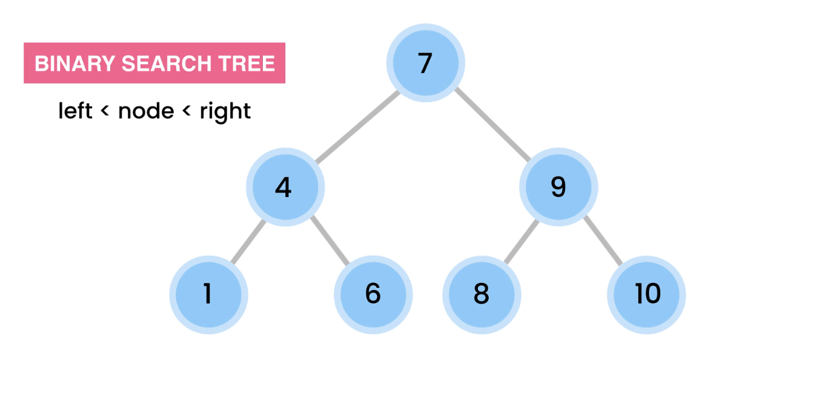
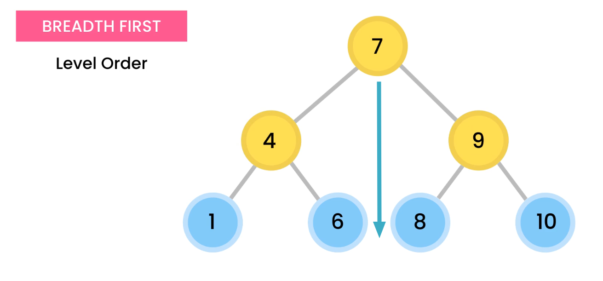
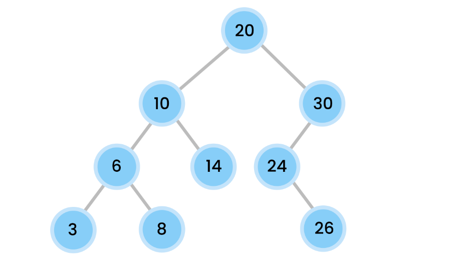

# Binary Tree
The binary tree is a data structure in which a node can have a smaller left child or a larger right child. In case a node has no left or right node, this node is called **Leave Node**.


## Methods

Mthods big O notation:
| Method | Cost   |
| ------ | ------ |
| Insert | Log(n) |
| Remove | Log(n) |
| find   | Log(n) |

### Add Method
Adding a value to the tree creates a new Node and we'll need to iterate the tree comparing the values of the node with the new value to choose whether we need to go right or left until this value is null, then bind the node there.

For example, if the value to insert is greater than the current node we are checking, we will search for the right children of the current node, if the right children are null, we must assign the new node to the right children.

### Find Method
The find method returns true if the value we checked is in the tree. We can very easily describe this method using recursion. If the base cases don't match, we just need to compare the value with the value of the current node to pick a direction.

```java
private boolean find(T value, Node current) {
    // base cases
    if (current == null) return false;

    if (value.equals(current.value))
        return true;
    
    // recursive cases
    int valueComp = current.value.compareTo(value);
    if ( valueComp == -1) // right
        return find(value, current.rigth);
    return find(value, current.left);
```
## Traversal methods
There are two main ways to traverse a tree, **BREADTH FIRST** and **Depth first**

### BREADTH First
It consists of going through the tree layer by layer, before going to another level, first we look at all the nodes of the same layer



The result of visiting the previous tree in Level Order would be the following.

> 7, 4, 9, 1, 6, 8, 10

### Depth first
It consists on visiting the childs before they parents. Of course we need to visit a parent before visiting a child, but we need to imagin in the order they would be printed.

There are three ways to do a Depth fist travesal wich are the following.
|Name      |Order                |
|----------|---------------------|
|Pre-Order |**Root**, Left, Right|
|In-Order  |[Left, **Root**, Right] OR [Right, **Root**, Left] |
|Post-Order|Left, Right, **Root**|

### Example

Given the following tree we are going to se how the value should be printed with each traversal method.



#### Breadth first
> 20, 10, 30, 6, 14, 24, 3, 8, 26

#### Depth first

**Pre-Order**
> 20, 10, 6, 3, 8, 14, 30, 24, 26

**In-Order**
> 3, 6, 8, 10, 14, 20, 24, 26, 30

We get a sorted list of nodes

**Post-Order**
> 3, 8, 6, 14, 10, 26, 24, 30, 20

### Implementation

First of all we will se how to implement **Depth first** because it's super easy using recursion.

#### Depth first

This method prints the values of the node in a Pre-Order way, as we can se we print the value of the root node and then execute preOrder for left and then right as simple as we saw in the the previous table.

> root -> left -> right

**Pre-order**

```java
private void preOrder(Node root) {
    // Base Case
    if (root == null) return;

    System.out.print(root.value + ", ");
    preOrder(root.left);
    preOrder(root.rigth);
}
```

Using that same logic, print the value of the root and call `method` for left and right, with changing the order of this three operations we can implement all the methods we want to implement as we can see in the following examples. 

**In-order**

```java
private void inOrder(Node root) {
    // Base case
    if (root == null) return;

    inOrder(root.left);
    System.out.print(root.value + ", ");
    inOrder(root.rigth);
}
```

**In-order** Reveresed

```java
private void inOrderReverse(Node root) {
    // Base case
    if (root == null) return;

    inOrderReverse(root.rigth);
    System.out.print(root.value + ", ");
    inOrderReverse(root.left);
}
```

**Post-Order**

```java
private void postOrder(Node root) {
    // Base case
    if (root == null) return;

    postOrder(root.left);
    postOrder(root.rigth);
    System.out.print(root.value + ", ");
}
```


<!-- # More information
[Big O of Binary tree search](https://persis-randolph.medium.com/big-o-notation-for-binary-search-trees-8f0f50b016ef) -->
