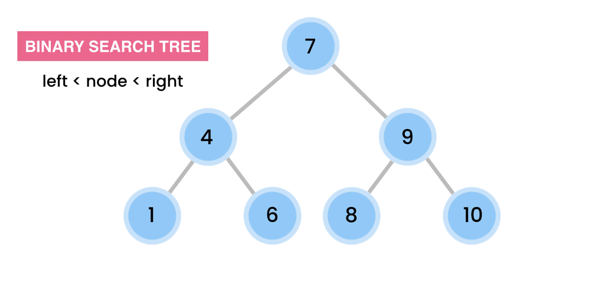
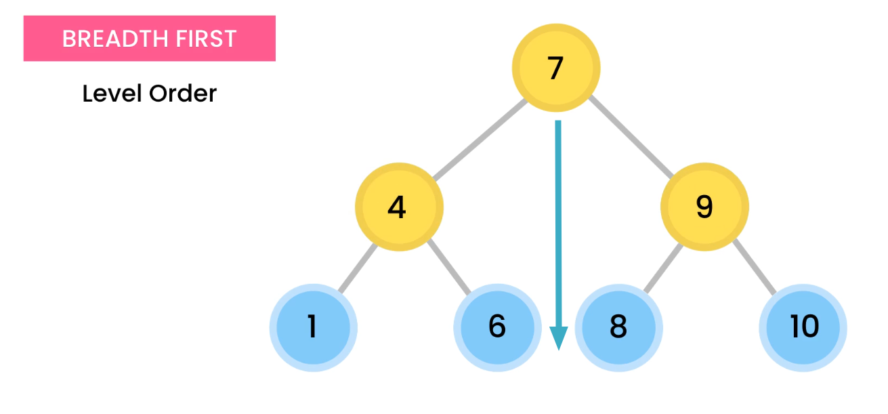
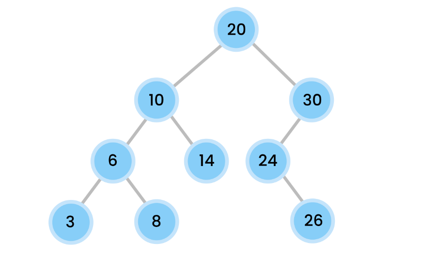
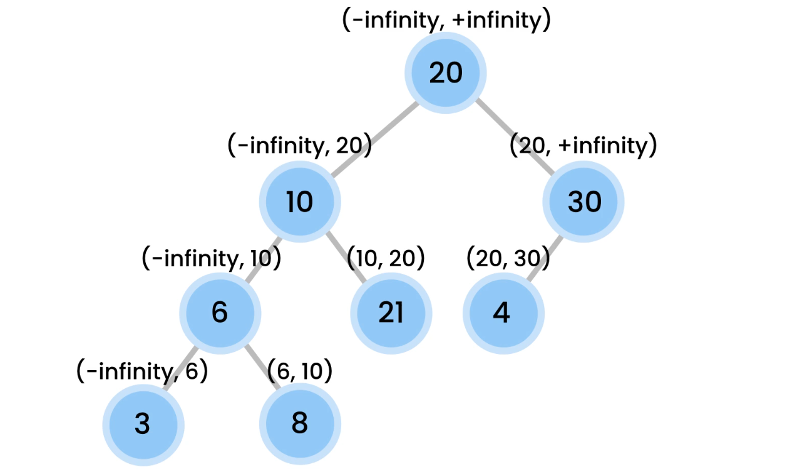

# Binary Tree
The binary tree is a data structure in which a node can have a smaller left child or a larger right child. In case a node has no left or right node, this node is called **Leave Node**.



# Table of Contents

- [Binary Tree](#binary-tree)
- [Table of Contents](#table-of-contents)
  - [Basic Methods](#basic-methods)
    - [Add Method](#add-method)
    - [Find Method](#find-method)
  - [Traversal methods](#traversal-methods)
    - [BREADTH First](#breadth-first)
    - [Depth first](#depth-first)
    - [Example](#example)
      - [Breadth first](#breadth-first-1)
      - [Depth first](#depth-first-1)
    - [Implementation](#implementation)
      - [Depth first](#depth-first-2)
  - [Exercices](#exercices)
    - [Reverse Binary Tree](#reverse-binary-tree)
    - [Depth and Height of a tree](#depth-and-height-of-a-tree)
    - [Minimum value](#minimum-value)
    - [Check for equality](#check-for-equality)
    - [Verify it's a binary search tree](#verify-its-a-binary-search-tree)
    - [Nodes at K distance from the root](#nodes-at-k-distance-from-the-root)
    - [Level Order Traversal](#level-order-traversal)
    - [Get size of a tree](#get-size-of-a-tree)
    - [Count leaves of a tree](#count-leaves-of-a-tree)
    - [Get the max value of a binary tree](#get-the-max-value-of-a-binary-tree)
    - [Check if two values are silblings](#check-if-two-values-are-silblings)
    - [Get ancestors of a value](#get-ancestors-of-a-value)

## Basic Methods

Mthods big O notation:
| Method | Cost   |
| ------ | ------ |
| Insert | Log(n) |
| Remove | Log(n) |
| find   | Log(n) |

### Add Method
Adding a value to the tree creates a new Node and we'll need to iterate the tree comparing the values of the node with the new value to choose whether we need to go right or left until this value is null, then bind the node there.

For example, if the value to insert is greater than the current node we are checking, we will search for the right children of the current node, if the right children are null, we must assign the new node to the right children.

### Find Method
The find method returns true if the value we checked is in the tree. We can very easily describe this method using recursion. If the base cases don't match, we just need to compare the value with the value of the current node to pick a direction.

```java
private boolean find(T value, Node current) {
    // base cases
    if (current == null) return false;

    if (value.equals(current.value))
        return true;
    
    // recursive cases
    int valueComp = current.value.compareTo(value);
    if ( valueComp == -1) // right
        return find(value, current.rigth);
    return find(value, current.left);
```
## Traversal methods
There are two main ways to traverse a tree, **BREADTH FIRST** and **Depth first**

### BREADTH First
It consists of going through the tree layer by layer, before going to another level, first we look at all the nodes of the same layer



The result of visiting the previous tree in Level Order would be the following.

> 7, 4, 9, 1, 6, 8, 10

### Depth first
It consists on visiting the childs before they parents. Of course we need to visit a parent before visiting a child, but we need to imagin in the order they would be printed.

There are three ways to do a Depth fist travesal wich are the following.
|Name      |Order                |
|----------|---------------------|
|Pre-Order |**Root**, Left, Right|
|In-Order  |[Left, **Root**, Right] OR [Right, **Root**, Left] |
|Post-Order|Left, Right, **Root**|

### Example

Given the following tree we are going to se how the value should be printed with each traversal method.



#### Breadth first
> 20, 10, 30, 6, 14, 24, 3, 8, 26

#### Depth first

**Pre-Order**
> 20, 10, 6, 3, 8, 14, 30, 24, 26

**In-Order**
> 3, 6, 8, 10, 14, 20, 24, 26, 30

We get a sorted list of nodes

**Post-Order**
> 3, 8, 6, 14, 10, 26, 24, 30, 20

### Implementation

First of all we will se how to implement **Depth first** because it's super easy using recursion.

#### Depth first

This method prints the values of the node in a Pre-Order way, as we can se we print the value of the root node and then execute preOrder for left and then right as simple as we saw in the the previous table.

> root -> left -> right

**Pre-order**

```java
private void preOrder(Node root) {
    // Base Case
    if (root == null) return;

    System.out.print(root.value + ", ");
    preOrder(root.left);
    preOrder(root.rigth);
}
```

Using that same logic, print the value of the root and call `method` for left and right, with changing the order of this three operations we can implement all the methods we want to implement as we can see in the following examples. 

**In-order**

```java
private void inOrder(Node root) {
    // Base case
    if (root == null) return;

    inOrder(root.left);
    System.out.print(root.value + ", ");
    inOrder(root.rigth);
}
```

**In-order** Reveresed

```java
private void inOrderReverse(Node root) {
    // Base case
    if (root == null) return;

    inOrderReverse(root.rigth);
    System.out.print(root.value + ", ");
    inOrderReverse(root.left);
}
```

**Post-Order**

```java
private void postOrder(Node root) {
    // Base case
    if (root == null) return;

    postOrder(root.left);
    postOrder(root.rigth);
    System.out.print(root.value + ", ");
}
```

## Exercices

### Reverse Binary Tree

To reverse a binary tree we just need to dominate the traversal methods because to reverse a binary tree we need to traverse the tree in a Post-Order way.

The logic to reverse a tree is swap the left child and the right child of each node going from the bottom to top. This is the swap method.

```java
private void swapChilds(Node node) {
    Node temp = node.left;
    node.left = node.rigth;
    node.rigth = temp;
}
```

The reverse method consists on replacing the print operation of the `traversePostOrder` method by `swapChilds(node)`. By doing this first we are calling recursively `reverse(left)` `reverse(right)` util we are reach the leaves nodes. Once in the leaves nodes, the swap method is executed down to up.

```java
private void reverse(Node root) {
    // Base case
    if (root == null) return;

    reverse(root.left);
    reverse(root.rigth);
    swapChilds(root);
}
```

More eficient method.

```java
private void reverseEfficient(Node root) {
    if (root.left != null)
        reverse(root.left);

    if (root.rigth != null)
        reverse(root.rigth);

    swapChilds(root);
}
```

Finally we neet a base method to call reverse recursively for the first time and pass root as the first argument.

```java
public void reverse() {
    reverse(root);
}
```

To check the result we can execute traverseInOrder, reverse, and traverseInOrderReverse and the result should be the same.

```java
private static void reverseTreeTest() {
    tree.TraverseInOrder();
    tree.reverse();
    System.out.println();
    tree.TraverseInOrderReverse();
}
```

Output

```out
3, 6, 8, 10, 14, 20, 24, 26, 30, 
3, 6, 8, 10, 14, 20, 24, 26, 30,
```

### Depth and Height of a tree
First of all we need to understand what Depth and Heigth means. **Depth** is the the layer where we can find the node, the Depth of the root is always 0 and the child Depth is parents depth +1. In the other side we have de Height wich is the number of layers we have in our tree or the maximum depth of a tree.

To find the maximum Depth of our tree we can also calculate the heigth of it, to calculate de height we can create a recursive function that compares de heigth of the two childs an return de big one plus 1.

```java
private int height(Node root) {
    if (root == null) return -1;
    return Math.max(height(root.left), height(root.rigth)) +1;
}
```

### Minimum value
We just need to do a Post-Order traverse and peek the minimum value of the children and the root in case of a binary tree. This time there is a few edge cases if children are null.
```java
private T minimum(Node root) {
    // base cases
    if (root.left == null && root.rigth == null)
        return root.value;

    if (root.left == null){
        T minRight = minimum(root.rigth);
        if (root.value.compareTo(minRight) == -1)
            return root.value;
        return minRight;
    }

    if (root.rigth == null) {
        T minLeft = minimum(root.left);
        if (root.value.compareTo(minLeft) == -1)
            return root.value;
        return minLeft;
    }

    T minLeft = minimum(root.left);
    T minRight = minimum(root.rigth);

    if (root.value.compareTo(minRight) == -1) {
        if (root.value.compareTo(minLeft) == -1)
            return root.value;
        else
            return minLeft;
    }
    if (minRight.compareTo(minLeft) == -1)
        return minRight;

    return minLeft;
}
```

In case of a binary tree search we can just go to the left until root.left is null.
```java
public T minBinaryTreeSearch() {
    var current = root;

    while (current.left != null)
        current = current.left;

    return current.value;
}
```

### Check for equality
We need to do a Pre-Order traversal to first check if the two roots are equal and if they are, we check if equals of left and equals of right is also true. The base cases are when both are null so they are equal (true) and where one is null and the other not null so it is not equal (false).

```java
public boolean equals(BinaryTree<T> otherTree) {
    if (otherTree == null) 
        return false;
    return equals(root, otherTree.root);
}

private boolean equals(Node thisRoot, Node otherRoot) {

    if (thisRoot != null && otherRoot != null) {
        return  thisRoot.equals(otherRoot) &&
                equals(thisRoot.left, otherRoot.left) &&
                equals(thisRoot.rigth, otherRoot.rigth);
    }
    // base case 1 both are null
    if (thisRoot == null && otherRoot == null)
        return true;

    // base case 2 One node is null but the other is not null
    return false;
}
```

### Verify it's a binary search tree

To verify if a tree is a binary tree search, we need to check all the Left nodes are smaller thant a Right nodes, this is very ineficient because we would need to check it for every subtree and would calculate multiple times each subtree. To solve this problem, we can establish a range that each node should have, we can not implement this problem in our tree at the moment but it would look like this. (Pre-Order Traversal).



This is how it would be implemented if the tree was a Integer tree.

```java
public boolean isBinarySearchTree() {
    return isBinarySearchTree(root, Integer.MIN_VALUE, Integer.MAX_VALUE);
}

private boolean isBinarySearchTree(Node root, int min, int max) {
    if (root == null)
        return true;
    return root.value < max && root.value > min && 
    isBinarySearchTree(root.left, min, root.value) &&
    isBinarySearchTree(root.rigth, root.value, max);
}
```

### Nodes at K distance from the root
Just to a Pre-Order traversal and decrement by 1 each time we call the recursive method util distance is 0.

```java
public void nodesAtKDistance(int distance) {
    nodesAtKDistance(distance, root);
}

private void nodesAtKDistance(int distance, Node root) {
    // Base case
    if (root == null)
        return;

    if (distance-- == 0) {
        System.out.println(root.value);
        return;
    }

    nodesAtKDistance(distance, root.left);
    nodesAtKDistance(distance, root.rigth);
}
```

### Level Order Traversal
Composed of heigth and nodes at kdistance, it could also be implemented with a hashmap to be more eficient in large trees.
```java
public void levelOrderTraversal() {
    for (int i = 0; i <= height(); i++)
        System.out.println(nodesAtKDistance(i));
}
```

### Get size of a tree
we can just do a Post-Order traversal and add 1 to the size of the child Nodes and return 0 if the node is null.

```java
public int size() {
    return size(root);
}

private int size(Node root) {
    if (root == null)
        return 0;
    return size(root.left) + size(root.rigth) + 1;
}
```


### Count leaves of a tree

To count the leaves of a tree we can just create a method called is leave and return 1, if is null return 0 to not afect the counter and use a Post-Order Traversal.

```java
public int countLeaves() {
    return countLeaves(root);
}

private int countLeaves(Node root) {
    if (root == null)
        return 0;

    if (isChild(root))
        return 1;
    return countLeaves(root.left) + countLeaves(root.rigth);
}

private boolean isChild(Node root) {
    return root.left == null && root.rigth == null;
}
```

### Get the max value of a binary tree


<!-- # More information
[Big O of Binary tree search](https://persis-randolph.medium.com/big-o-notation-for-binary-search-trees-8f0f50b016ef) -->

### Check if two values are silblings

```java
public boolean areSibling(T value1, T value2) {
    return areSibling(root, value1, value2);
}

private boolean areSibling(Node root, T value1, T value2) {
    if (root == null) {
        return false;
    }

    if (root.left != null && root.rigth != null && isSiblingNode(root, value1, value2))
        return true;

    return areSibling(root.left, value1, value2) || areSibling(root.rigth, value1, value2);
}

private boolean isSiblingNode(Node root, T value1, T value2) {
    return value1.equals(root.left.value) && value2.equals(root.rigth.value) ||
    value1.equals(root.rigth.value) && value2.equals(root.left.value);
}
```

### Get ancestors of a value
```java
public List<T> getAncestors(T value) {
    List<T> ancestors = new ArrayList<>();
    getAncestors(root, value, ancestors);
    return ancestors;
}

private boolean getAncestors(Node root, T value, List<T> ancestors) {
    // base case 1
    if (root == null)
        return false;

    // base case 2
    if (root.value == value)
        return true;

    boolean isParent = getAncestors(root.left, value, ancestors) || getAncestors(root.rigth, value, ancestors);
    if (isParent)
        ancestors.add(root.value);

    return isParent;
}
```